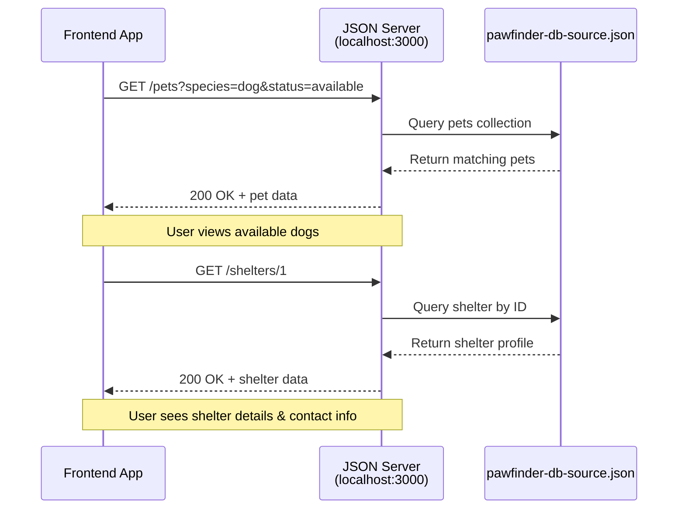

# PawFinder Service

_PawFinder is a project for shared documentation practice and educational
purposes only._ While using `json-server` to simulate a pet adoption
platform, the following content intends to show how to design, document,
and maintain a REST API using realistic pet adoption scenarios.

**SME**: Veena Acharya\
**TW**: Rhyannon Joy Rodriguez

---

## PawFinder API

Build adoption platforms that connect paws with people. PawFinder is
the REST API for real-time shelter data in the Dallas-Fort Worth area.

- Explore [PawFinder API Documentation](https://rhyannonjoy.github.io/pawfinder-service/)
for more information.
- Use the
[Installation Guide](https://rhyannonjoy.github.io/pawfinder-service/docs/overview/installation-guide/)
to set up the development environment.
- Learn how PawFinder protects pet and shelter data with token-based authentication in the
[Authentication Guide](https://rhyannonjoy.github.io/pawfinder-service/docs/overview/authentication-guide/).
    - `GET` requests don't require authentication.
    - Write operations, `POST`, `PUT`, `PATCH`, and `DELETE`, do.
- Get up and running with the
[Quickstart Guide](https://rhyannonjoy.github.io/pawfinder-service/docs/overview/quickstart-guide/)
    - Condensed version in the "Getting Started" section below.
- Visit the
[Contribution Guide](https://rhyannonjoy.github.io/pawfinder-service/docs/overview/contribution-guide/)
to report issues or suggest improvements.
- Review the
[API Index](https://rhyannonjoy.github.io/pawfinder-service/docs/api-reference/api-index/)
for the complete reference for all endpoint operations, parameters, and responses.

## Build with PawFinder

- **Adoption apps**: search available pets by species, breed, age, location, and temperament
- **Shelter integrations**: update adoption statuses across platforms
- **Notification systems**: send alerts when pets matching preferences become available
- **Comparison tools**: develop pet matching algorithms with detailed adoption data

## Learn with PawFinder

**API architecture**:

- Understand REST principles with a realistic domain
- Practice filtering, pagination, and error handling
- Explore API documentation best practices

**Frontend development**:

- Test an adoption platform UI without backend dependencies
- Quickly mock data for different scenarios
- Develop and test before real backend is ready

**Technical writing practice**:

- Document API endpoints with request/response examples
- Create tutorials for different user personas
- Write guides that help developers succeed

## Getting started

_This is the condensed version. For step-by-step instructions, visit the
[Installation Guide](https://rhyannonjoy.github.io/pawfinder-service/docs/overview/installation-guide/)._

### Installation

```bash
# Clone the repository from the command line
git clone https://github.com/rhyannonjoy/pawfinder-service.git
cd pawfinder-service

# Install dependencies
npm install
```

### Start the server

```bash
# Option 1: use npm (recommended)
npm start

# Option 2: call json-server directly
cd api
json-server --w pawfinder-db-source.json
```

Explore PawFinder API data at: `http://localhost:3000`

### Customizing the data

Edit `api/pawfinder-db-source.json` to add, update, or remove
pet and shelter profiles. `json-server` automatically reflects
the changes as the server restarts.

### First request: get all available dogs

Recommended base_url: `http://localhost:3000`

```bash
# Option 1: cURL command
# -X GET is optional, as GET is the default operation
curl -X GET {base_url}/pets?species=dog&status=available
```

```javascript
// Option 2: JavaScript method
fetch('{base_url}/pets?species=dog&status=available')
  .then(response => response.json())
  .then(data => console.log(data));
```

**Response** `200 OK`

```json
[
  {
      "name": "Max",
      "species": "dog",
      "breed": "Golden Retriever Mix",
      "age_months": 36,
      "gender": "male",
      "size": "large",
      "temperament": "energetic, loyal",
      "medical": {
        "spayed_neutered": true,
        "vaccinations": ["rabies", "dhpp", "leptospirosis"]
      },
      "description": "Max is an active dog who needs regular
                     exercise and responds well to commands.",
      "shelter_id": 2,
      "status": "available",
      "intake_date": "2025-07-20",
      "id": 2
    }
]
```

## PawFinder request flow


