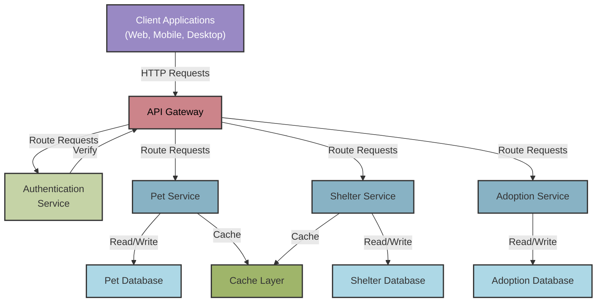

## API Index

### Getting started

PawFinder is a REST API for managing
pet adoption data. All endpoints use JSON for requests
and responses, available at `http://localhost:3000`.

### Authentication

`GET` requests are public and don't require authentication.
All write operations - `POST`, `PUT`, `PATCH`, and `DELETE` -
require a valid API token. Visit the
[Authentication Guide](../overview/authentication-guide.md)
for more information.

### High-level architecture

PawFinder is an educational project using `json-server` and minimal
authentication. A production system would likely use a more robust
architecture resembling the diagram below:

### Reference topics

#### Resources

- [`/pets` resource](pets.md)
- [`/shelters` resource](shelters.md)

#### `/pets` operations

- [`GET` all pet profiles](get-all-pets.md)
- [`GET` pet profiles by `id`](get-pets-by-id.md)
- [`GET` pet profiles from a specific shelter](get-pets-from-shelter.md)
- [`GET` pet profiles using filters](get-pets-with-filters.md)
- [`POST` pet profiles](post-pets.md)
- [`PUT` pet profiles by `id`](put-pets-by-id.md)
- [`PATCH` pet profiles by `id`](patch-pets-by-id.md)
- [`DELETE` pet profiles by `id`](delete-pets-by-id.md)

#### `/shelters` operations

- [`GET` all shelter profiles](get-all-shelters.md)
- [`GET` shelter profiles by `id`](get-shelters-by-id.md)
- [`POST` shelter profiles](post-shelters.md)
- [`PUT` shelter profiles by `id`](put-shelters-by-id.md)
- [`PATCH` shelter profiles by `id`](patch-shelters-by-id.md)
- [`DELETE` shelter profiles by `id`](delete-shelters-by-id.md)

### Common error responses for all endpoints

| Code | Scenario | Response |
|---|---|---|
| `401` | Missing API token | `{ "error": "Unauthorized", "message": "Authentication token is required for this operation." }` |
| `403` | Invalid or expired API token | `{ "error": "Forbidden", "message": "Invalid or expired authentication token." }` |
| `429` | Rate limit exceeded | `{ "error": "Too Many Requests", "message": "Rate limit exceeded. Try again in 60 seconds.", ... }` |
| `500` | Server error | `{ "error": "Internal Server Error", "message": "An unexpected error occurred. Please try again later." }` |
| `503` | API under maintenance | `{ "error": "Service Unavailable", "message": "API is temporarily unavailable for maintenance." }` |

### Troubleshooting

If encountering connection errors like `Connection refused` or
`ENOBUFS` while testing with high request volumes, this typically
indicates the local port is reaching its connection limit.
This is normal during stress testing and doesn't reflect production
API performance. To continue testing locally, either increase OS
connection limits, run many instances on different ports such as
3001, 3002, or test against a staging environment if available.

**OS-specific guidance**:

- **Linux**: Use `ulimit -n` to check current file descriptor
limits and change `/etc/security/limits.conf` to increase them
- **macOS**: Use `launchctl maxfiles` to adjust file limits,
or change `/etc/launchd.conf` for persistent changes
- **Windows**: Change the registry key
`HKEY_LOCAL_MACHINE\SYSTEM\CurrentControlSet\Services\Tcpip\Parameters`
and adjust `MaxUserPort` to increase ephemeral port range

### Versioning

PawFinder doesn't use URI versioning, but a
production environment might include a version support
policy resembling the following:

- PawFinder supports all major versions for 24 months after
a new version releases.
- Deprecated endpoints include a `Sunset` header indicating
end-of-life date.
- PawFinder introduces breaking changes in major version increments.
- Minor updates and bug fixes won't require version changes.
