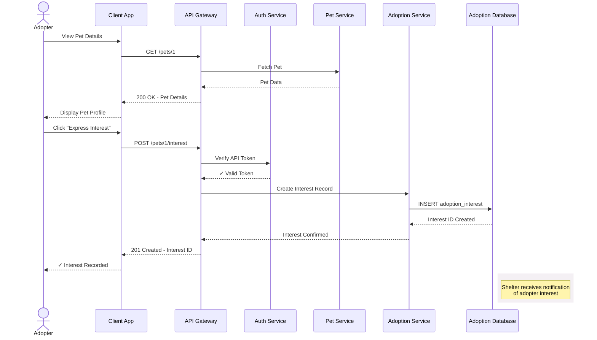

## Get pet profiles by `id`

This operation retrieves a pet's profile by their `id`.
Use this operation to show complete pet details on profile
pages, enable direct linking to specific pet profiles,
or update information when users return to a formerly
viewed pet profile.

### Pet adoption interest workflow

When displaying a pet profile, a client app may allow users
to express interest in adopting the pet. The sequence
diagram below shows how this workflow might interact with
a production system that has a more robust architecture:



### Endpoint structure

```bash
GET /pets/{id}
```

### Path parameters

| Parameter | Type | Required | Description |
|---|---|---|---|
| `id` | integer | Yes | Pet's unique identifier |

### Request headers

| Header | Value | Required |
|---|---|---|
| `Content-Type` | `application/json` | No |

### Authentication

This operation doesn't require authentication.

### Request body

This operation doesn't require a request body.

### cURL request

```bash
# Retrieve the pet profile with `id`= 1
# -X GET is optional, as GET is the default operation
# Recommended base_url = http://localhost:3000
curl -X GET {base_url}/pets/1
```

### Response fields

Each pet profile object contains the following properties:

| Property | Type | Value Format |
|---|---|---|
| `name` | string | Any text |
| `species` | string | `cat` or `dog` |
| `breed` | string | Any text |
| `age_months` | integer | Numeric value |
| `gender` | string | `male` or `female` |
| `size` | string | `small`, `medium`, or `large` |
| `temperament` | string | Any text |
| `medical` | object | See nested fields below |
| `medical.spayed_neutered` | boolean | `true` or `false` |
| `medical.vaccinations` | array | Array of strings |
| `description` | string | Any text |
| `shelter_id` | integer | Numeric value |
| `status` | string | `available`, `pending`, or `adopted` |
| `intake_date` | string | ISO 8601 Format, "YYYY-MM-DD" |
| `id` | integer | Auto-generated, read-only |

### Success response `200`

Returns a pet profile object:

```json
{
  "name": "Luna",
  "species": "cat",
  "breed": "Domestic Shorthair",
  "age_months": 18,
  "gender": "female",
  "size": "small",
  "temperament": "playful, affectionate",
  "medical": {
    "spayed_neutered": true,
    "vaccinations": ["fvrcp", "rabies"]
  },
  "description": "Luna is a playful tabby who loves interactive toys and sunny windows.",
  "shelter_id": 1,
  "status": "available",
  "intake_date": "2025-09-01",
  "id": 1,
}
```

### Error responses

| Code | Scenario | Response |
|---|---|---|
| `400` | Invalid `id` | `{ "error": "Bad Request", "message": "Invalid pet 'id'. Must be a positive integer." ...}` |
| `404` | No matching `id` | `{ "error": "Not Found", "message": "Pet with 'id' 999 not found.", ...}` |

### Related topics

- [`/pets` resource](pets.md)
- [Add a new pet profile](post-pets.md)
- [Delete a pet profile](delete-pets-by-id.md)
- [Partially update a pet profile](patch-pets-by-id.md)
- [Replace an existing pet profile](put-pets-by-id.md)
