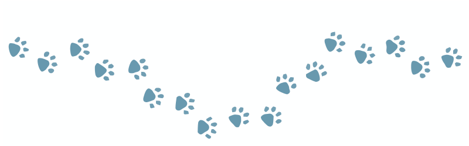
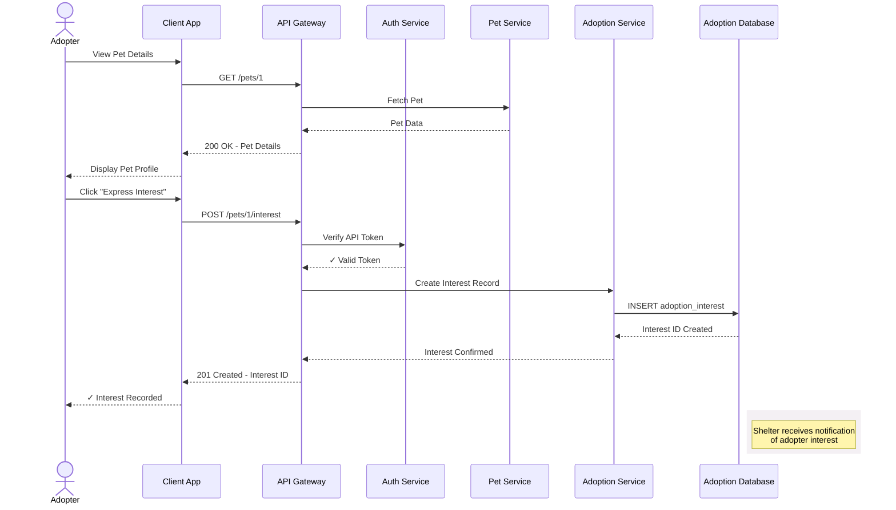

## Get pet profiles by `id`

This operation retrieves a pet's profile by their `id`.
Use this endpoint to retrieve information about a specific
pet, such as, after a user clicks on a pet profile
from search results.

### Pet adoption interest workflow

When displaying a pet profile, a client app may allow users
to express interest in adopting the pet. The sequence
diagram below shows how this workflow might interact with
a production system that has a more robust architecture:



### Endpoint structure

```bash
GET /pets/{id}
```

### Path parameters

| Parameter | Type | Required | Description |
|---|---|---|---|
| `id` | integer | Yes | Pet's unique identifier |

### Request headers

| Header | Value | Required |
|---|---|---|
| `Content-Type` | `application/json` | No |

### Authentication

This operation doesn't require authentication.

### Request body

This operation doesn't require a request body.

### cURL request

```bash
# Recommended base_url = http://localhost:3000
curl -X GET {base_url}/pets/1
```

### Example responses

| Status | Scenario | Response |
|---|---|---|
| `200` | `id` match | `{ "name": "Luna", "species": "cat",...}` |
| `400` | Invalid `id` | `{ "error": "Bad Request", "message": "Invalid pet ID. Must be a positive integer." ...}` |
| `404` | No matching `id` | `{ "error": "Not Found", "message": "Pet with ID 999 not found.", ...}` |

**Successful responses includes a list of pets with the following**:

- `name`: Pet's name
- `species`: Pet's species
- `breed`: Pet's breed if known
- `age_months`: Pet's age in months
- `gender`: Pet's gender if known
- `size`: Pet's size category
- `temperament`: Pet's personality traits and behavioral characteristics
- `medical`: Pet's medical information
- `description`: Pet's personality, needs, background
- `shelter_id`: ID of pet's current shelter
- `status`: Pet's adoption status
- `intake_date`: When the pet entered the shelter
- `id`: Pet's unique record ID

### Related topics

- [`/pets` resource](pets.md)
- [Add a new pet profile](post-pets.md)
- [Delete a pet profile](delete-pets-by-id.md)
- [Partially update a pet profile](patch-pets-by-id.md)
- [Replace an existing pet profile](put-pets-by-id.md)
