## Get pet profiles using filters

This operation retrieves pets profiles that match the specified
filter criteria. Use this endpoint to power search and discover
features in an adoption platform.

### Pet search workflow

The sequence diagram below shows how a search request might flow through a production system with a more robust architecture and
cache optimization for frequently searched queries:

```mermaid
sequenceDiagram
    actor App as Client App
    participant Gateway as API Gateway
    participant Auth as Auth Service
    participant PetSvc as Pet Service
    participant Cache as Cache Layer
    participant PetDB as Pet Database
    
    App->>Gateway: GET /pets?species=dog&shelter_id=1
    Gateway->>Auth: Verify Request
    Auth-->>Gateway: ✓ Valid (GET is public)
    Gateway->>Cache: Check Cache for Query
    
    alt Cache Hit
        Cache-->>Gateway: Cached Results
    else Cache Miss
        Gateway->>PetSvc: Query Pets by Filters
        PetSvc->>PetDB: SELECT * FROM pets WHERE...
        PetDB-->>PetSvc: Pet Records
        PetSvc->>Cache: Store Results (TTL: 5min)
        PetSvc-->>Gateway: Pet Array
    end
    
    Gateway-->>App: 200 OK - Pets Array
    App->>App: Display Search Results

    rect rgba(200, 180, 200, 0.2)
    note right of App: User sees filtered pets<br/>with availability status
    end
```



### Endpoint structure

```bash
GET /pets?{query_parameters}
```

### Path parameters

This operation doesn't require path parameters.

### Query parameters

This operation accepts the following optional query parameters
to filter results:

| Parameter | Type | Description |
|-----------|------|-------------|
| `species` | string | Filter pets by species, `cat`|
| `status` | string | Filter pets by adoption status, `available`|
| `breed` | string | Filter pets by breed |
| `size` | string | Filter pets by size category, `small`|
| `gender` | string | Filter pets by gender |
| `shelter_id` | integer | Filter pets by shelter ID |

### Request headers

| Header | Value | Required |
|---|---|---|
| `Content-Type` | `application/json` | No |

### Authentication

This operation doesn't require authentication.

### Request body

This operation doesn't require a request body.

### cURL request

```bash
# Recommended base_url = http://localhost:3000
curl -X GET {base_url}/pets?species=cat&status=available
```

### Example responses

| Status | Scenario | Response |
|---|---|---|
| `200` | Match found | `[{ "name": "Luna", "species": "cat",...}]` |
| `200` | No matches | `[]` |
| `400` | Malformed query parameters | `{ "error": "Bad Request", "message": "Invalid query parameter format", ...}` |

**Successful responses includes a list of pets with the following**:

- `name`: Pet's name
- `species`: Pet's species
- `breed`: Pet's breed if known
- `age_months`: Pet's age in months
- `gender`: Pet's gender if known
- `size`: Pet's size category
- `temperament`: Pet's personality traits and behavioral characteristics
- `medical`: Pet's medical information
- `description`: Pet's personality, needs, background
- `shelter_id`: ID of pet's current shelter
- `status`: Pet's adoption status
- `intake_date`: When the pet entered the shelter
- `id`: Pet's unique record ID

### Related topics

- [`/pets` resource](pets.md)
- [Get all pet profiles](get-all-pets.md)
- [Add a new pet profile](post-pets.md)
- [Delete a pet profile](delete-pets-by-id.md)
- [Replace an existing pet profile](put-pets-by-id.md)
- [Partially update a pet profile](patch-pets-by-id.md)
