## Get pet profiles using filters

This operation retrieves pet profiles that match the specified
filter criteria. Use this operation to help users narrow search
results by preferences like `species` and `temperament`, power
"best match" recommendation features, or enable shelter staff
to filter shelter inventory for administrative reporting.

### Pet search workflow

The sequence diagram below shows how a search request might flow
through a production system with a more robust architecture and
cache optimization for frequently searched queries:

```mermaid
sequenceDiagram
    actor App as Client App
    participant Gateway as API Gateway
    participant Auth as Auth Service
    participant PetSvc as Pet Service
    participant Cache as Cache Layer
    participant PetDB as Pet Database
    
    App->>Gateway: GET /pets?species=dog&shelter_id=1
    Gateway->>Auth: Verify Request
    Auth-->>Gateway: ✓ Valid (GET is public)
    Gateway->>Cache: Check Cache for Query
    
    alt Cache Hit
        Cache-->>Gateway: Cached Results
    else Cache Miss
        Gateway->>PetSvc: Query Pets by Filters
        PetSvc->>PetDB: SELECT * FROM pets WHERE...
        PetDB-->>PetSvc: Pet Records
        PetSvc->>Cache: Store Results (TTL: 5min)
        PetSvc-->>Gateway: Pet Array
    end
    
    Gateway-->>App: 200 OK - Pets Array
    App->>App: Display Search Results

    rect rgba(200, 180, 200, 0.2)
    note right of App: User sees filtered pets<br/>with availability status
    end
```



### Endpoint structure

```bash
GET /pets?{query_parameters}
```

### Path parameters

This operation doesn't require path parameters.

### Query parameters

This operation accepts the following optional query parameters
to filter results:

| Parameter | Type | Values |
|-----------|------|-------------|
| `species` | string | `cat`, `dog` |
| `status` | string | `available`, `pending`, `adopted` |
| `breed` | string | `Maine Coon`, `Golden Retriever` |
| `size` | string | `small`, `medium`, `large` |
| `gender` | string | `male`, `female` |
| `shelter_id` | integer | `123`, `456` |

### Request headers

| Header | Value | Required |
|---|---|---|
| `Content-Type` | `application/json` | No |

### Authentication

This operation doesn't require authentication.

### Request body

This operation doesn't require a request body.

### cURL request

```bash
# Retrieve the profiles of all available cats
# -X GET is optional, as GET is the default operation
# Recommended base_url = http://localhost:3000
curl -X GET {base_url}/pets?species=cat&status=available
```

### Response fields

Each pet profile object contains the following properties:

| Property | Type | Value Format |
|---|---|---|
| `name` | string | Any text |
| `species` | string | `cat` or `dog` |
| `breed` | string | Any text |
| `age_months` | integer | Numeric value |
| `gender` | string | `male` or `female` |
| `size` | string | `small`, `medium`, or `large` |
| `temperament` | string | Any text |
| `medical` | object | See nested fields below |
| `medical.spayed_neutered` | boolean | `true` or `false` |
| `medical.vaccinations` | array | Array of strings |
| `description` | string | Any text |
| `shelter_id` | integer | Numeric value |
| `status` | string | `available`, `pending`, or `adopted` |
| `intake_date` | string | ISO 8601 Format, "YYYY-MM-DD" |
| `id` | integer | Auto-generated, read-only |

### Success response `200`

Either returns an empty array `[]` for no results or
an array of pet profile objects:

```json
[
  {
    "name": "Luna",
    "species": "cat",
    "breed": "Domestic Shorthair",
    "age_months": 18,
    "gender": "female",
    "size": "small",
    "temperament": "playful, affectionate",
    "medical": {
      "spayed_neutered": true,
      "vaccinations": ["fvrcp", "rabies"]
    },
    "description": "Luna is a playful tabby who loves
                  interactive toys and sunny windows.",
    "shelter_id": 1,
    "status": "available",
    "intake_date": "2025-09-01",
    "id": 1,
  },
  ...
]
```

### Error responses

| Code | Scenario | Response |
|---|---|---|
| `400` | Malformed query parameters | `{ "error": "Bad Request", "message": "Invalid query parameter format", ...}` |
| `404` | Incorrect endpoint | `{ "error": "Not Found", "message": "The requested endpoint does not exist.", ... }`|
| `429` | Rate limit exceeded | `{ "error": "Too Many Requests", "message": "Rate limit exceeded. Try again in 60 seconds.", ... }`|

### Related topics

- [`/pets` resource](pets.md)
- [Get all pet profiles](get-all-pets.md)
- [Add a new pet profile](post-pets.md)
- [Delete a pet profile](delete-pets-by-id.md)
- [Replace an existing pet profile](put-pets-by-id.md)
- [Partially update a pet profile](patch-pets-by-id.md)
