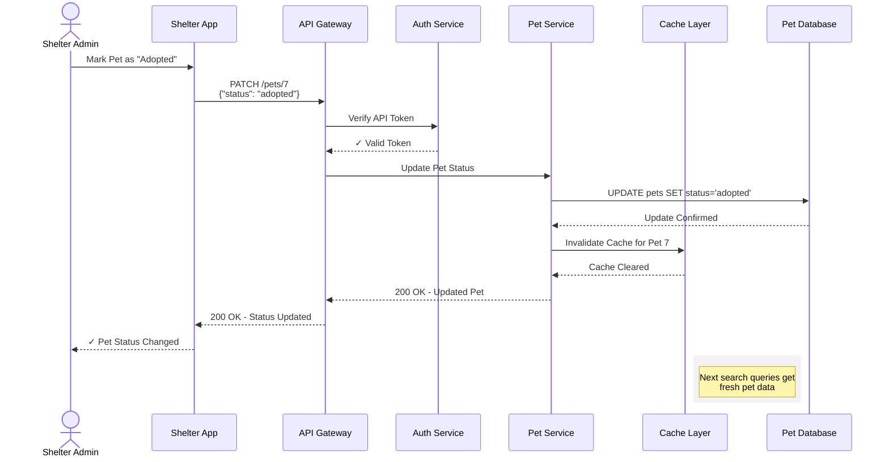

## Partially update a pet profile

This operation updates specific fields of an existing pet
record without affecting other data. Use this endpoint when
shelter staff need to edit details without replacing the
entire pet profile, such as changing a pet's `status`
to mark them as `adopted`.

### PUT vs PATCH

`PUT` replaces an entire profile and sets missing fields to
`null` or default values. `PATCH` only updates the fields
provided in the request body, leaving the other fields
unchanged. `PATCH` is typically used for pet inventory updates.

### Shelter pet inventory update workflow

The sequence diagram below shows how a shelter might update pet
`status` through PawFinder's services in a production environment
with a more robust architecture, including authentication
requirements and cache invalidation to make sure that other
users see fresh data:



### Endpoint structure

```bash
PATCH /pets/{id}
```

### Request headers

| Header | Value | Required |
|---|---|---|
| `Content-Type` | `application/json` | Yes |

### Authentication

**Required** - include an API token in the Authorization header:

```bash
Authorization: Bearer API_TOKEN
```

### Request body

Only include fields that need updating.
Omitted fields remain unchanged.

| Property | Type | Value Format |
|---|---|---|
| `name` | string | Any text |
| `species` | string | `cat` or `dog` |
| `breed` | string | Any text |
| `age_months` | integer | Numeric value |
| `gender` | string | `male` or `female` |
| `size` | string | `small`, `medium`, or `large` |
| `temperament` | string | Any text |
| `medical` | object | See nested fields below |
| `medical.spayed_neutered` | boolean | `true` or `false` |
| `medical.vaccinations` | array | Array of strings |
| `description` | string | Any text |
| `shelter_id` | integer | Numeric value |
| `status` | string | `available`, `pending`, or `adopted` |
| `intake_date` | string | ISO 8601 Format, "YYYY-MM-DD" |
| `id` | integer | Auto-generated, read-only |

### cURL request

```bash
# Recommended base_url = http://localhost:3000
curl -X PATCH {base_url}/pets/4 \
  -H "Content-Type: application/json" \
  -d '{
    "status": "adopted",
    "medical": {
      "spayed_neutered": true,
      "vaccinations": ["rabies", "dhpp", "leptospirosis"]
    }
  }'
```

### Example responses

| Code | Scenario | Response |
|---|---|---|
| `200` | `id` match | `{ "name": "Bella", "species": "dog",...}` |
| `400` | Invalid `id` | `{ "error": "Bad Request", "message": "Invalid pet 'id'. Must be a positive integer." ...}` |
| `404` | No matching `id` | `{ "error": "Not Found", "message": "Pet with 'id' 4 not found.", ...}` |

### Related topics

- [`/pets` resource](pets.md)
- [Get all pet profiles](get-all-pets.md)
- [Add a new pet profile](post-pets.md)
- [Delete a pet profile](delete-pets-by-id.md)
- [Replace an existing pet profile](put-pets-by-id.md)
