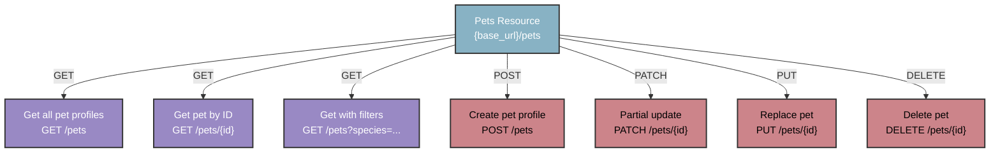

## `/pets` resource

This resource represents pet profiles in the PawFinder system
across all adoption stages. Use this endpoint to manage pet
inventory, power search and filtering features, and track pets
from intake through adoption. Shelters must register before
adding new pet profiles, visit the [/shelters resource](shelters.md)
for details.

Base endpoint:

```shell
# Recommended base_url = http://localhost:3000
{base_url}/pets
```

### `/pets` map



### Pet profile object fields

| Property name | Type | Description | Value Format |
| ------------- | ----------- | ----------- |----------- |
| `name` | string | Pet's name | Any text |
| `species` | string | Pet's animal type | `cat`, `dog` |
| `breed` | string | Pet's breed or breed mix | Any text |
| `age_months` | integer | Pet's age in months | Numeric value |
| `gender` | string | Pet's gender | `male`, `female` |
| `size` | string | Pet's size category | `small`, `medium`, `large` |
| `temperament` | string | Pet's personality traits, behavioral characteristics | Any text |
| `medical` | object | Pet's medical information | See nested fields below |
| `medical.spayed_neutered` | boolean | Pet's spay/neuter state | `true` or `false` |
| `medical.vaccinations` | array | List of pet's current vaccinations | Any text |
| `description` | string | Pet's personality, needs, background | Any text |
| `shelter_id` | integer | Unique identifier of pet's current shelter| Numeric value |
| `status` | string | Pet's current adoption stage | `available`, `pending`, or `adopted`|
| `intake_date` | string | Pet's shelter entry date | ISO 8601 Format, "YYYY-MM-DD" |
| `id` | integer | Pet's unique identifier | Auto-generated, read-only |

### Example pet profile object

```json
{
  "name": "Luna",
  "species": "cat",
  "breed": "Domestic Shorthair",
  "age_months": 18,
  "gender": "female",
  "size": "small",
  "temperament": "playful, affectionate",
  "medical": {
    "spayed_neutered": true,
    "vaccinations": ["fvrcp", "rabies"]
  },
  "description": "Luna is a playful tabby who loves
                 interactive toys and sunny windows.",
  "shelter_id": 1,
  "status": "available",
  "intake_date": "2025-09-01",
  "id": 1,
}
```

### Operations

- [Get all pet profiles](get-all-pets.md)
- [Get a pet profile by `id`](get-pets-by-id.md)
- [Get pet profiles from a specific shelter](get-pets-from-shelter.md)
- [Get pet profiles using filters](get-pets-with-filters.md)
- [Create a new pet profile](post-pets.md)
- [Delete a pet profile](delete-pets-by-id.md)
- [Partially update a pet profile](patch-pets-by-id.md)
- [Replace a pet profile](put-pets-by-id.md)

### Authentication

`GET` requests don't require authentication. Write operations
`POST`, `PUT`, `PATCH`, and `DELETE` require an API token.
Visit the [Authentication Guide](../overview/authentication-guide.md)
for instructions and security best practices.
