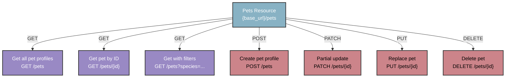

## `/pets` resource

This reference contains information about pet profiles stored
in the PawFinder system. Shelters must register in the service
before listing a new pet. Visit the [shelters resource](shelters.md).

Base endpoint:

```shell
# Recommended base_url = http://localhost:3000
{base_url}/pets
```

### `/pets` map



### Example pet profile

```json
{
  "name": "Luna",
  "species": "cat",
  "breed": "Domestic Shorthair",
  "age_months": 18,
  "gender": "female",
  "size": "small",
  "temperament": "playful, affectionate",
  "medical": {
    "spayed_neutered": true,
    "vaccinations": ["fvrcp", "rabies"]
  },
  "description": "Luna is a playful tabby who loves
                 interactive toys and sunny windows.",
  "shelter_id": 1,
  "status": "available",
  "intake_date": "2025-09-01",
  "id": 1,
}
```

| Property name | Type | Description |
| ------------- | ----------- | ----------- |
| `name` | string | Pet's name |
| `species` | string | Pet's animal type |
| `breed` | string | Pet's breed or breed mix |
| `age_months` | integer | Pet's age in months |
| `gender` | string | Pet's gender |
| `size` | string | Pet's size category |
| `temperament` | string | Pet's personality traits, behavioral characteristics |
| `medical` | object | Pet's medical information |
| `medical.spayed_neutered` | boolean | Pet's spay/neuter status |
| `medical.vaccinations` | array | List of pet's current vaccinations |
| `description` | string | Pet's personality, needs, background |
| `shelter_id` | integer | ID of pet's current shelter|
| `status` | string | Pet's current adoption status |
| `intake_date` | string | When the pet entered the shelter |
| `id` | integer | Pet's unique record ID |

### Field requirements

- `species`: Must be `cat`, `dog`
- `gender`: Must be `male`, `female`
- `size`: Must be `small`, `medium`, `large`
- `medical.spayed_neutered`: Must be a boolean
- `medical.vaccinations`: Must be an array of strings
- `status`: Must be `available`, `pending`, or `adopted`
- `intake_date`: Must be in ISO 8601 format, such as "2025-09-01"
- `shelter_id`: PawFinder auto-generates this field and users can't change it directly.
- `id`: PawFinder auto-generates this field and users can't change it directly.

### Operations

- [Get all pet profiles](get-all-pets.md)
- [Get a pet profile by `id`](get-pets-by-id.md)
- [Get pet profiles using filters](get-pets-with-filters.md)
- [Create a new pet profile](post-pets.md)
- [Delete a pet profile](delete-pets-by-id.md)
- [Partially update a pet profile](patch-pets-by-id.md)
- [Replace a pet profile](put-pets-by-id.md)

### Authentication

`GET` requests don't require authentication. Write operations
`POST`, `PUT`, `PATCH`, and `DELETE` require an API token.
Visit the [Authentication Guide](../overview/authentication-guide.md)
for instructions and security best practices.
