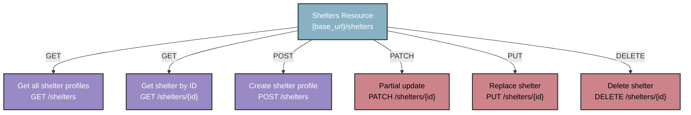

## `/shelters` resource

This resource represents animal shelters and rescue organizations
in the PawFinder network. Use this endpoint to manage shelter
profiles, display shelter contact information and operating hours,
and track facility details like location and pet availability
numbers. Shelters must register before adding pet profiles,
visit the [/pets resource](pets.md) for pet profile
management details.

Base endpoint:

```shell
# Recommended base_url = http://localhost:3000
{base_url}/shelters
```

### `/shelters` map



### Shelter profile object fields

| Property | Type | Description | Value Format |
|---|---|---|---|
| `name` | string | Shelter's name | Any text |
| `address` | string | Shelter's location information | Any text |
| `phone` | string | Shelter's phone number | E.164 format: "+1-XXX-XXX-XXXX" |
| `email` | string | Shelter's email address | Any text |
| `hours` | string | Shelter's hours of operation | Any text |
| `available_pet_count` | integer | Shelter's available pets | Numeric value |
| `adoption_fee_range` | string | Shelter's fee range | United States Dollars |
| `id` | integer | Shelter's unique identifier | Auto-generated, read-only |

### Example shelter profile object

```json
{
  "name": "Dallas Animal Services",
  "address": "1818 N Westmoreland Rd, Dallas, TX 75212",
  "phone": "+1-214-671-0249",
  "email": "info@dallasanimalservices.org",
  "hours": "Mon-Sat 11:00-18:00",
  "available_pet_count": 22,
  "adoption_fee_range": "75-200",
  "id": 1
}
```

### Operations

- [Get all shelter profiles](get-all-shelters.md)
- [Get a shelter profile by `id`](get-shelters-by-id.md)
- [Get pet profiles from a specific shelter](get-pets-from-shelter.md)
- [Create a new shelter profile](post-shelters.md)
- [Delete a shelter profile](delete-shelters-by-id.md)
- [Partially update a shelter profile](patch-shelters-by-id.md)
- [Replace a shelter profile](put-shelters-by-id.md)

### Authentication

`GET` requests don't require authentication. Write operations
`POST`, `PUT`, `PATCH`, and `DELETE` require an API token.
Visit the [Authentication Guide](../overview/authentication-guide.md)
for instructions and security best practices.
