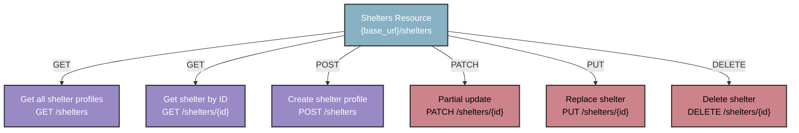

## `/shelters` resource

This reference provides information about animal shelters
and rescue organizations in the PawFinder network. Shelters
must register in the service before listing pets for adoption.
Visit the [pets resource](pets.md).

Base endpoint:

```shell
# Recommended base_url = http://localhost:3000
{base_url}/shelters
```

### `/shelters` map



### Example shelter profile

```json
{
  "name": "Dallas Animal Services",
  "address": "1818 N Westmoreland Rd, Dallas, TX 75212",
  "phone": "+1-214-671-0249",
  "email": "info@dallasanimalservices.org",
  "hours": "Mon-Sat 11:00-18:00",
  "available_pet_count": 22,
  "adoption_fee_range": "75-200",
  "id": 1
}
```

| Property name | Type | Description |
| ------------- | ----------- | ----------- |
| `name` | string | Shelter's official name |
| `address` | string | Shelter's address information |
| `phone` | string | Shelter's phone number |
| `email` | string | Shelter's email address |
| `hours` | string | Shelter's operating hours |
| `available_pet_count` | integer | Number of shelter's available pets |
| `adoption_fee_range` | string | Shelter's typical adoption fee range |
| `id` | number | Shelter's unique record ID |

### Field requirements

- `phone`: Must be in  E.164 format, such as +1-XXX-XXX-XXXX
- `adoption_fee_range`: Must be in USD, format "min - max"
- `id`: PawFinder auto-generates this field and users can't change it directly.

### Operations

- [Get all shelter profiles](get-all-shelters.md)
- [Get a shelter profile by `id`](get-shelters-by-id.md)
- [Get pet profiles from a specific shelter](get-pets-from-shelter.md)
- [Create a new shelter profile](post-shelters.md)
- [Delete a shelter profile](delete-shelters-by-id.md)
- [Partially update a shelter profile](patch-shelters-by-id.md)
- [Replace a shelter profile](put-shelters-by-id.md)

### Authentication

`GET` requests don't require authentication. Write operations
`POST`, `PUT`, `PATCH`, and `DELETE` require an API token.
Visit the [Authentication Guide](../overview/authentication-guide.md)
for instructions and security best practices.
