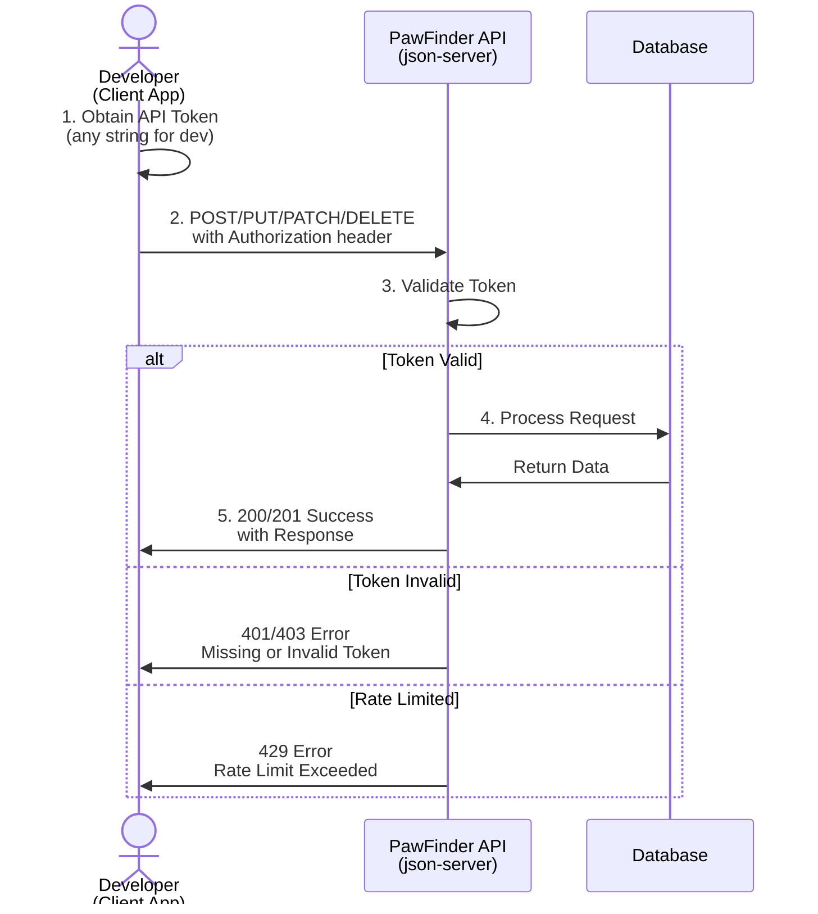

## Authentication guide

### Overview

The PawFinder Service API uses a token-based authentication system.
Read-only operations, `GET` requests, don't require authentication.
Operations that change data, such as `POST`, `PUT`, `PATCH`, and
`DELETE` require an API token passed in the request header.

### Authentication flow

The diagram below illustrates how PawFinder authentication works.
Developers following a write operation workflow can refer to this
visual to understand the complete request lifecycle: from creating
an API token through successful data operations or error handling.
This diagram shows the authentication happy path and the error
states developers may encounter:



### Authenticating requests

For any write operation, include the API token in the `Authorization` header:

```shell
Authorization: Bearer API_TOKEN
```

#### Authenticated example request

```bash
# Recommended base_url = http://localhost:3000
curl -X POST {base_url}/shelters \
  -H "Authorization: Bearer API_TOKEN" \
  -H "Content-Type: application/json" \
  -d '{
    "name": "Dallas Animal Rescue",
    "city": "Dallas",
    "state": "TX"
  }'
```

#### Read-only example request

```bash
# -X GET is optional, as GET is the default operation
curl -X GET {base_url}/shelters
```

### Create an API token

**Most tutorials only read data and don't need authentication.**\
Return here to set up an API token when using tutorials
to create, update, or delete PawFinder records.

For development and testing purposes, assign any string as the token.
In a production environment, PawFinder would issue tokens through
a proper authentication system.

**For local development:**

1. As described in the [Installation Guide](installation-guide.md),
start the PawFinder:

   ```bash
   # Option 1: use npm (recommended)
   npm run

   # Option 2: call json-server directly
   json-server -w pawfinder-db-source.json
   ```

2. Use any string as the token, such as `"test-token"`, `"dev-token"`, etc.
3. Pass it in the `Authorization: Bearer` header to perform write operations.

### Security best practices

- **Never commit tokens to version control.** Use environment variables
or create an `.env` file and add it to the `.gitignore` file.
- **Rotate tokens regularly** in production environments.
- **Use different tokens for different environments** such as development,
stage, QA, and production.
- **Store tokens securely** and treat them like passwords.
- **Limit token permissions**. In a production environment with a robust
backend system, use tokens with write-only or read-only scopes as needed.

#### Environment variable example

```bash
# Store the token in an .env file and don't commit it to git
API_TOKEN=secret_token

# Use the token in the request
curl -X POST {base_url}/pets \
  -H "Authorization: Bearer $API_TOKEN" \
  -H "Content-Type: application/json" \
  -d '{"name": "Buddy", "species": "dog"}'
```

### Common error responses

| Code | Scenario | Response |
|---|---|---|
| `401` | Missing API token | `{ "error": "Unauthorized", "message": "Authentication token is required for this operation.", ... }` |
| `403` | Invalid or expired API token | `{ "error": "Forbidden", "message": "Invalid or expired authentication token.", ...}` |
| `429` | Rate limit exceeded | `{ "error": "Too Many Requests", "message": "Rate limit exceeded. Try again in 60 seconds.", ...}` |

### Rate limiting

For development and testing, there are currently no strict
[rate limits](https://www.geeksforgeeks.org/system-design/rate-limiting-in-system-design/),
as `json-server` isn't designed for high-volume traffic. A production
environment may use rate limiting to:

- Prevent abuse
- Ensure fair access across users
- Protect backend resources

A typical approach would limit requests per IP or API token over a time window.
In a production environment, responses might include rate limit headers:

```shell
X-RateLimit-Limit: 60
X-RateLimit-Remaining: 45
X-RateLimit-Reset: 1638360000
```

An example breakdown of client request limits:

| Tier | Requests per minute | Daily limit |
|------|---------------------|-------------|
| Free | 60 | 1,000 |
| Standard | 300 | 10,000 |
| Premium | 1,000 | 100,000 |
| Enterprise | Custom | Custom |

### Implementation note

The PawFinder Service API is a project for _shared documentation practice
and educational purposes only._ PawFinder uses `json-server` and an intentionally
minimal authentication system. For a production system, consider the following:

- [Audit logging](https://www.datadoghq.com/knowledge-center/audit-logging/)
of all authenticated requests
- [Cryptographic key management](https://www.geeksforgeeks.org/computer-networks/easy-key-management-in-cryptography/)
- [OAuth 2.0](https://oauth.net/2/) or similar industry-standard authentication
- [Abuse prevention systems](https://www.akamai.com/glossary/what-is-api-abuse)
with robust rate limiting methods
- [Token TTLs](https://www.geeksforgeeks.org/computer-networks/what-is-time-to-live-ttl/),
time to live policies, and refresh mechanisms
