## Installation guide

Set up the development environment for PawFinder tutorials.\
_Estimated preparation: ~20 minutes._

### Software prerequisites

Open the links in separate browser tabs before installing any software.

- A [GitHub account](https://github.com)
- A development system running a current version or LTS, long-term support,
version of the Windows, MacOS, or Linux operating system.
- [Git, command line](https://docs.github.com/en/get-started/quickstart/set-up-git)
- [GitHub Desktop](https://desktop.github.com): _optional, but recommended_
- A fork of the [PawFinder Service repository](https://github.com/rhyannonjoy/pawfinder-service)
- A current or LTS version of [Node.js](https://nodejs.org/en/download),
_includes npm_
- Version 0.17.4 of [`json-server`](https://www.npmjs.com/package/json-server)
- [Postman desktop app](https://www.postman.com/downloads/): _desktop version required; web version incompatible with `http://localhost`_
  
    **Tip**: while using a fork of the repository, create a working
    branch in which to complete the tutorials. Create a new branch for
    each tutorial to prevent a mistake in one from affecting any
    work in another.

### Installation workflow at-a-glance

```mermaid
graph LR
  A["Prerequisites"]
  B["Fork &<br/>Clone"]
  C["Install"]
  D["Start"]
  E["Test"]
  F["✓ Ready"]
  
  A --> B
  B --> C
  C --> D
  D --> E
  E --> F
  
  style A fill:#9989c4,stroke:#333,stroke-width:2px,color:#fff,font-family:Helvetica
  style B fill:#88b2c4,stroke:#333,stroke-width:2px,color:#fff,font-family:Helvetica
  style C fill:#88b2c4,stroke:#333,stroke-width:2px,color:#fff,font-family:Helvetica
  style D fill:#cc848a,stroke:#333,stroke-width:2px,color:#000,font-family:Helvetica
  style E fill:#cc848a,stroke:#333,stroke-width:2px,color:#000,font-family:Helvetica
  style F fill:#9fb56a,stroke:#333,stroke-width:2px,color:#000,font-family:Helvetica
```



### Fork and clone the repository

**Fork on GitHub**

1. Navigate to the
[PawFinder Service repository](https://github.com/rhyannonjoy/pawfinder-service)
2. Find the **Fork** button in the top-right corner
3. Select where to fork (typically a personal GitHub account)
4. Wait for the fork to complete
5. Once forked, clone the repository locally using either
GitHub Desktop or the command line.

**Clone with GitHub Desktop:**

1. Open GitHub Desktop
2. Click **File** > **Clone Repository**
3. Select the **GitHub.com** tab
4. Find the forked `pawfinder-service` repository
5. Choose a local path for the project
6. Click **Clone**

**Clone on the command line:**

```bash
git clone https://github.com/USERNAME/pawfinder-service.git
cd pawfinder-service
```

Confirm that the clone contains the `pawfinder-db-source.json`
database file in the `api` directory.

### Install dependencies

```bash
cd pawfinder-service
npm install
```

### Verify the development setup

#### Step 1: Create and checkout a test branch

**Use GitHub Desktop:**

1. Open GitHub Desktop
2. Click the **Current Repository** dropdown in the top-left corner
3. Select `pawfinder-service` from the list
4. Click the **Current Branch** dropdown in the top center, it likely says `main`
5. Click the **New Branch** button
6. In the "Name" field, type: `tutorial-test`
7. Ensure "Create branch based on" shows the `main` branch
8. Click **Create Branch**

GitHub Desktop automatically switches to the new `tutorial-test` branch.
The **Current Branch** dropdown should display `tutorial-test`.

**Use the command line:**

```bash
cd pawfinder-service
git checkout -b tutorial-test
```

#### Step 2: Start the service

```bash
# Option 1: use npm (recommended)
# Run from the pawfinder-service root directory
npm start
```

```bash
# Option 2: call json-server directly
# Run from the pawfinder-service api directory
cd api
json-server -w pawfinder-db-source.json
```

#### Step 3: Test the service

**Use cURL**

```bash
# -X GET is optional, as GET is the default operation
curl -X GET http://localhost:3000/shelters
```

**Use Postman desktop app**

1. Open the Postman desktop app
2. Select the `+` button to create a new request
3. Select `GET` from the HTTP method drop-down list
4. Add the URL: `http://localhost:3000/shelters`
5. Click **Send**
6. Review the response

If the service is running correctly it retrieves a list of shelters:

```json
[
    {
      "name": "Dallas Animal Services",
      "address": "1818 N Westmoreland Rd, Dallas, TX 75212",
      "phone": "+1-214-671-0249",
      "email": "info@dallasanimalservices.org",
      "hours": "Mon-Sat 11:00-18:00",
      "available_pet_count": 22,
      "adoption_fee_range": "75-200",
      "id": 1
    },
    {
      "name": "Fort Worth Animal Care & Control",
      "address": "4900 Martin St, Fort Worth, TX 76119",
      "phone": "+1-817-392-1234",
      "email": "adopt@fortworthanimalcare.org",
      "hours": "Mon-Fri 11:00-18:00, Sat-Sun 12:00-17:00",
      "available_pet_count": 18,
      "adoption_fee_range": "50-175",
      "id": 2
    },
    ...
]
```

### Troubleshooting

When encountering errors in any of the installation steps,
investigate, and correct the error before moving forward.
Common situations that cause errors:

- Repository not cloned to local machine
- Dependencies not installed, run `npm install`
- Mistyped commands
- Running the service from the wrong directory
- Required software component didn't install correctly
- Required software component isn't up to date
- Port 3000 already in use by another app

If the service correctly retrieves a list of shelter profiles,
move on to the [Quickstart Guide](quickstart-guide.md).
