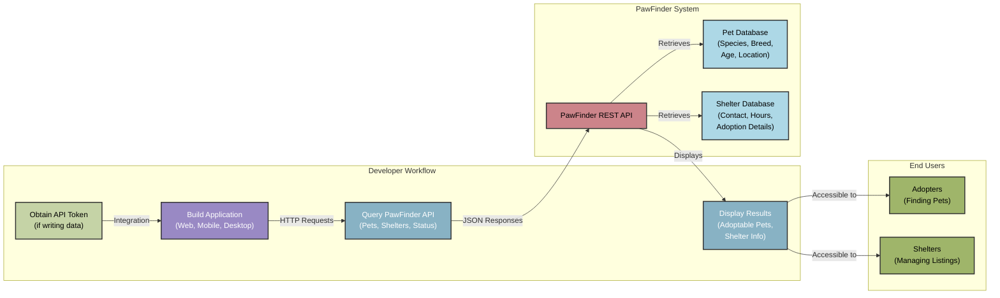

## PawFinder API Overview

### Introduction

PawFinder is a REST API connecting adoptable pets with potential families
across the Dallas-Fort Worth area. Real-time data from hundreds of shelters
makes it easier for people to find their perfect companion and for shelters
to reach qualified adopters. This API enables developers to:

- Search available pets by `species`, `breed`, `age_months`, `shelter_id`
and `temperament`
- Access detailed shelter profiles and contact information
- Track adoption `status` updates in real time
- Build custom adoption workflows and notification systems

### Developer journey

PawFinder is an educational project using `json-server` and minimal
authentication. The diagram below shows how client apps might fit
into a production environment PawFinder ecosystem, visualizing
the flow from initial concept to real-world impact.

The diagram illustrates three key perspectives:

1. **Developer Workflow** is in purple and outlines the integration steps
developers take: creating an API token for write operations, building
apps across any platform, querying the PawFinder API for pet and shelter
data, and displaying results to end users.
1. **PawFinder System** is in mauve and shows the data developers can get
through PawFinder, which fetches standardized pet information and
shelter details from dedicated databases.
1. **End Users** is in olive and demonstrates the impact: apps built with
PawFinder serve adopters searching for companions and shelters managing
listings, bridging the gap between both audiences through the API.

### Key concepts

#### Pets

Each pet in the PawFinder system has a unique identifier and includes standardized
information such as `species`, `breed`, `age_months`, `size`, `temperament`, medical history,
and current location. Pets transition through adoption statuses tracked by the API.

#### Shelters

Organizations register as shelters to list pets for adoption. Each shelter maintains
a profile with contact information, operating hours, and adoption details. Shelters
can update pet listings and adoption statuses through the API.

#### Adoption `status`

Pets progress through defined `status` states:

- `available`: ready for adoption inquiries
- `pending`: adoption applications under review
- `adopted`: successfully placed with a family

#### Search filters

Filter pet profiles using any combination of these parameters:

- **Species**: `cat` or `dog`
- **Physical traits**: `breed`, `age_months`, `gender`, `size`
- **Behavior**: `temperament` - activity level, "good with kids"
- **Location**: `shelter_id`
- **Availability**: `status`

### Development use cases

#### For adopters

- Build mobile apps that send push notifications when pets matching user preferences
become available.
- Create location-aware web apps that display nearby adoptable pets.
- Develop pet comparison tools that help users understand different characteristics.

#### For shelters

- Integrate PawFinder search into existing shelter websites to increase visibility.
- Automate adoption `status` updates across many listing platforms.
- Generate analytics reports on inquiry rates and adoption trends.

#### For communities

- Build aggregator sites that compare pets across many shelters.
- Create matching algorithms that pair adopters with compatible pets.
- Develop volunteer coordination tools that connect shelter needs with
community support.

### Next steps

- [Installation Guide](installation-guide.md)
- [Authentication Guide](authentication-guide.md)
- [Quickstart Guide](quickstart-guide.md)
- [Contribution Guide](contribution-guide.md)
- [API Index](../api-reference/api-index.md)
