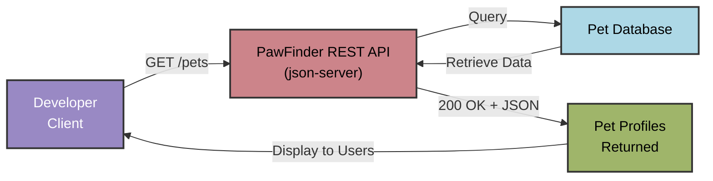

## Quickstart guide

Quickly integrate the PawFinder Service API. This guide covers
making a `GET` request to the `/pets` endpoint to retrieve
a list of pet profiles.

### Prerequisites

Read-only operations don't require authentication, but complete
all appropriate steps in the
[Installation Guide](installation-guide.md)
before continuing this tutorial.

### Request flow

The diagram below illustrates how a request for available pets
flows through the PawFinder system. Developers send a `GET` request
to the API, which queries the database and returns standardized
pet profiles. Understanding this flow helps developers construct
effective requests and interpret responses as they build
pet adoption features.



### Step 1: Start the service

```bash
# Option 1: use npm (recommended)
# Run from the pawfinder-service root directory
npm start
```

```bash
# Option 2: call json-server directly
# Run from the pawfinder-service api directory
cd api
json-server -w pawfinder-db-source.json
```

### Step 2: Call the service

```bash
# Recommended base_url = http://localhost:3000
# -X GET is optional, as GET is the default operation
curl -X GET "{base_url}/pets"
```

### Use Postman desktop app

1. Open the Postman desktop app
2. Create a new request
3. Set the method to `GET`
4. Enter the URL: `{base_url}/pets`
5. Click **Send**

### Step 3: Review the response

A successful request returns a `200 OK` status code with a JSON
array of pet profiles, for example:

```json
[
  {
    "id": 1,
    "name": "Luna",
    "species": "cat",
    "breed": "Domestic Shorthair",
    "age_months": 18,
    "gender": "female",
    "size": "small",
    "temperament": "playful, affectionate",
    "medical": {
      "spayed_neutered": true,
      "vaccinations": ["fvrcp", "rabies"]
    },
    "description": "Luna is a playful tabby who loves
                   interactive toys and sunny windows.",
    "shelter_id": 1,
    "status": "available",
    "intake_date": "2025-09-01"
  }
]
```

#### Pet profile fields

| Property name | Type | Description | Value Format |
| ------------- | ----------- | ----------- |----------- |
| `name` | string | Pet's name | Any text |
| `species` | string | Pet's animal type | `cat`, `dog` |
| `breed` | string | Pet's breed or breed mix | Any text |
| `age_months` | integer | Pet's age in months | Numeric value |
| `gender` | string | Pet's gender | `male`, `female` |
| `size` | string | Pet's size category | `small`, `medium`, `large` |
| `temperament` | string | Pet's personality traits, behavioral characteristics | Any text |
| `medical` | object | Pet's medical information | See nested fields below |
| `medical.spayed_neutered` | boolean | Pet's spay/neuter status | `true` or `false` |
| `medical.vaccinations` | array | List of pet's current vaccinations | Any text |
| `description` | string | Pet's personality, needs, background | Any text |
| `shelter_id` | integer | Unique identifier of pet's current shelter| Numeric value |
| `status` | string | Pet's current adoption stage | `available`, `pending`, or `adopted`|
| `intake_date` | string | Pet's shelter entry date | ISO 8601 format, "2025-09-01" |
| `id` | integer | Pet's unique identifier | Auto-generated, read-only |

### Filter pet profile results

Filter results by adding query parameters to the request.

```bash
# Find all available dogs
curl -X GET "{base_url}/pets?species=dog&status=available"
```

```bash
# Find all cats at a specific shelter
curl -X GET "{base_url}/pets?species=cat&shelter_id=1"
```

```bash
# Sort pet profiles by name, in ascending order
curl -X GET "{base_url}/pets?_sort=name&_order=asc"
```

For more filtering options, visit
[Get pet profiles using filters](../api-reference/get-pets-with-filters.md).

### Paginate large result sets

Use `_limit` and `_start` to paginate through results.

```bash
# Get the first 10 results
curl -X GET "{base_url}/pets?_limit=10&_start=0"

# Get the next 10 results
curl -X GET "{base_url}/pets?_limit=10&_start=10"
```

### Common error responses

| Code | Scenario | Response |
|---|---|---|
| `400` | Malformed parameters | `{ "error": "Bad Request", "message": "Invalid query parameter format", ...}`  |
| `404` | Malformed `base_url` | `{ "error": "Not Found", "message": "Server can't find resource", ... }`|
| `429` | Rate limit exceeded | `{ "error": "Too Many Requests", "message": "...Try again in 60 seconds.", ... }`|

### Get help

- Review the [`/pets` resource](../api-reference/pets.md)
for field requirements.
- Review [common errors](../api-reference/api-index.md).
- Open an issue on [GitHub](https://github.com/rhyannonjoy/pawfinder-service/issues).

### Next steps

- Explore the [API Index](../api-reference/api-index.md)
for complete endpoint documentation.
- Check out the [Find the Perfect Pet](../tutorials/api-fundamentals/find-perfect-pet.md)
tutorial for advanced filtering.
- View the [PawFinder source code on GitHub](https://github.com/rhyannonjoy/pawfinder-service).
