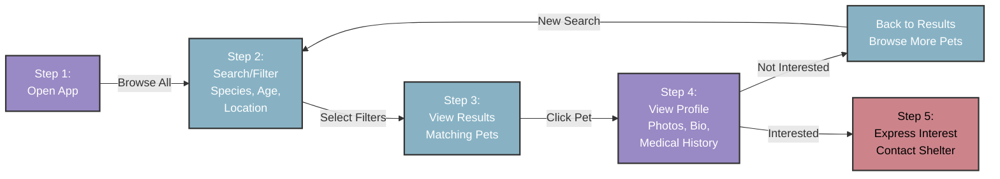

## Find the perfect pet

Use PawFinder to discover adoptable pets using search and filter
options like `species`, `breed`, `age_months`, and `shelter_id`. This
tutorial walks through the typical user journey: browsing available
pets → applying filters → viewing details → expressing interest.

### How the search workflow works

The PawFinder Service API provides an endpoint for searching
adoptable pets from shelters in the Dallas-Fort Worth area.
Complete all appropriate steps in the
[Installation Guide](../../overview/installation-guide.md)
before continuing this tutorial.

PawFinder uses `json-server` with basic search features.
The diagram below shows what a production adoption plaform
might look like when implementing pet search features:



### Endpoint structure

```bash
# Recommended base_url = http://localhost:3000
GET {base_url}/pets
```

### Query parameters

Filter results using exact matches for the following parameters:

#### Core filters

| Parameters  | Type | Description | Examples |
|-----------|------|-------------|----------|
| `species` | string | Pet's animal type | `dog`, `cat` |
| `breed` | string | Pet's breed | `Maine Coon`, `Golden Retriever`|
| `gender` | string | Pet's gender | `male`, `female`|
| `shelter_id` | integer | Shelter's unique identifier | 1, 2, 3, 4 |

#### `size` and `status` filters

| Parameters  | Type | Description | Examples |
|-----------|------|-------------|----------|
| `size` | string | Pet's size category | `small`,  `medium`, `large` |
| `status` | string | Pet's availability | `available`,  `pending`, `adopted` |

#### Pagination

`json-server` uses underscores for special query parameters `_limit`,
`_offset`, `_sort`, and `_order`, which differs from standard
REST conventions.

| Parameters  | Type | Description | Notes |
|-----------|------|-------------|----------|
| `_limit` | integer | Results per page | Default: all results |
| `_offset` | integer | Results to skip | Use with `_limit` |
| `_sort` | string | Field to sort by | `name`, `age`, `intake_date` |
| `_order` | string | Sort direction | default `desc` |

### cURL request examples

Below are common search scenarios. The first two show complete responses.
See the "Best practices" section below for handling larger result
sets with pagination.

**Example 1**: find all available dogs

```bash
# -X GET is optional, as GET is the default operation
curl -X GET "{base_url}/pets?species=dog&status=available" \
  -H "Content-Type: application/json"
```

**Response** `200 OK`

```json
[
  {
    "name": "Max",
    "species": "dog",
    "breed": "Golden Retriever Mix",
    "age_months": 36,
    "gender": "male",
    "size": "large",
    "temperament": "energetic, loyal",
    "medical": {
      "spayed_neutered": true,
      "vaccinations": [
        "rabies",
        "dhpp",
        "leptospirosis"
      ]
    },
    "description": "Max is an active dog who needs regular exercise
                   and responds well to commands.",
    "shelter_id": 2,
    "status": "available",
    "intake_date": "2025-07-20",
    "id": 2
  },
  ...
]
```

**Example 2**: find all available cats at Dallas Animal Services

```bash
# -X GET is optional, as GET is the default operation
curl -X GET "{base_url}/pets?species=cat&shelter_id=1&status=available" \
  -H "Content-Type: application/json"
```

**Response** `200 OK`

```json
[
  {
    "name": "Luna",
    "species": "cat",
    "breed": "Domestic Shorthair",
    "age_months": 18,
    "gender": "female",
    "size": "small",
    "temperament": "playful, affectionate",
    "medical": {
      "spayed_neutered": true,
      "vaccinations": ["fvrcp", "rabies"]
    },
    "description": "Luna is a playful tabby who loves 
                   interactive toys and sunny windows.",
    "shelter_id": 1,
    "status": "available",
    "intake_date": "2025-09-01",
    "id": 1
  },
  {
    "name": "Oliver",
    "species": "cat",
    "breed": "Maine Coon",
    "age_months": 24,
    "gender": "male",
    "size": "large",
    "temperament": "gentle, calm",
    "medical": {
      "spayed_neutered": true,
      "vaccinations": ["fvrcp", "rabies"]
    },
    "description": "Oliver is a gentle giant who loves to be
                   brushed and cuddled.",
    "shelter_id": 1,
    "status": "available",
    "intake_date": "2025-08-15",
    "id": 5
  }
]
```

**More Examples**:

```bash
# Retrieve all the profiles of Maine Coon cats (exact match required)
curl -X GET "{base_url}/pets?species=cat&breed=Maine%20Coon" \
  -H "Content-Type: application/json"
```

```bash
# Work with large sets of pet data
# Fetch the first 2 results sorted by `name` in ascending order
curl -X GET "{base_url}/pets?_limit=2&_start=0&_sort=name&_order=asc" \
  -H "Content-Type: application/json"
```

```bash
# Find dog profiles sorted by how recently they arrived at the shelter
curl -X GET "{base_url}/pets?species=dog&shelter_id=2&_sort=intake_date&_order=desc" \
  -H "Content-Type: application/json"
```

### Common responses

| Code | Scenario | Response |
|---|---|---|
| `200` | Successful with matches | `[{ "name": "Luna", "species": "cat",...}]` |
| `200` | Successful without matches | `[]` |
| `400` | Invalid parameters | `{ "error": "Bad Request", "message": "Invalid query parameter format" ...}` |

### Best practices

- **Start broad, then refine**\
Begin with filters like  `species` and `shelter_id`, then
add more specific criteria to narrow results.
- **Use pagination for large result sets**\
Always use [pagination](https://www.merge.dev/blog/rest-api-pagination)
when displaying results to handle large datasets efficiently.
Set an appropriate `_limit` and use `_offset` to fetch the next pages.
- **Cache results locally**\
Consider
[caching search results](https://www.geeksforgeeks.org/system-design/caching-strategies-for-api/)
on the client-side with a reasonable time to live to reduce API calls
and improve user experience.
- **Verify user input**\
Always
[sanitize and verify](https://www.esecurityplanet.com/endpoint/prevent-web-attacks-using-input-sanitization/)
filter parameters on the client-side before sending requests to
prevent unnecessary API errors.
- **Handle rate limiting**\
Use
[exponential backoff](https://henrychan.tech/why-your-api-retries-keep-failing-fix-it-with-exponential-backoff/)
when encountering the rate limit response: `429 Too Many Requests`.
- **Combine filters logically**\
Use
[`AND` logic](https://www.electrical-info.net/2025/11/logic-gates.html)
when combining many filters. For example,
`species=dog&temperament=calm` returns dogs that are
calm, not all dogs plus all calm pets.

### Troubleshooting

- **No results returned**\
Filters are too restrictive. Try removing filters
one at a time to identify which criteria is limiting results.
- **Invalid parameter error**\
Check that all parameter values match the accepted values listed
in the documentation. For example, use `dog` not `dogs`.
- **Slow response times**\
While using pagination with a high total count, consider adding
more specific filters to reduce the dataset size.

### Next steps

- Reference the [/pets resource](../../api-reference/pets.md)
for comprehensive `/pets` endpoint documentation.
- Explore the [/shelters resource](../../api-reference/shelters.md)
for the `/shelters` endpoint schema, operations, and parameters.
- Visit the [Contribution Guide](../../overview/contribution-guide.md)
to report issues or suggest improvements.
