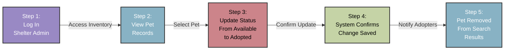
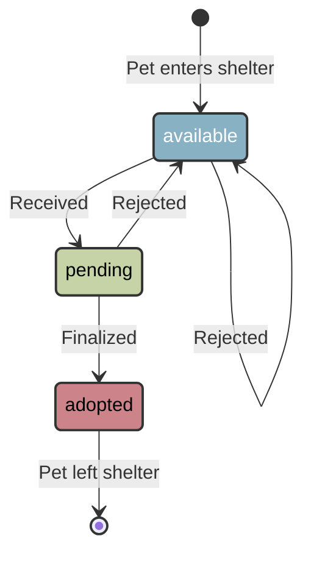

## Mark a pet as `adopted`

Update a pet profile `status` when finalizing adoptions.
Learn how to update pet records using the `PATCH` method
and manage adoption workflows from the shelter perspective.

### How the adoption workflow works

The PawFinder Service API provides an endpoint for updating pet
profiles as adoptions progress.

PawFinder uses `json-server` with basic `status` updates.
The diagram below shows what a production shelter management
system might look like when tracking pet adoptions:



### Prerequisites

- Complete all appropriate steps in the
[Installation Guide](../../overview/installation-guide.md)
before continuing this tutorial.
- This tutorial modifies data and requires an API token.
Visit the
[Authentication Guide](../../overview/authentication-guide.md)
for instructions.

### Endpoint structure

```bash
# Recommended base_url = http://localhost:3000
PATCH {base_url}/pets/{id}
```

### Path parameters

| Parameter | Type | Description | Example |
|-----------|------|-------------|---------|
| `id` | integer | Pet's unique identifier | 1, 2, 3, 4 |

### Authentication

**Required** - include an API token in the Authorization header:

```bash
Authorization: Bearer API_TOKEN
```

### Request body

Provide a JSON object with the fields to update. Only include
fields that are changing, as `PATCH` only updates the specified fields
and leaves the others unchanged.

| Field | Type | Description | Example |
|-------|------|-------------|---------|
| `status` | string | Pet's current adoption stage | `available`, `pending`, `adopted` |
| `medical` | object | Pet's medical information | `{"spayed_neutered": true, "vaccinations": [...]}` |

### Understanding state transitions

Pet `status` moves through a defined workflow. Understanding these
transitions help shelter staff manage adoption inquiries efficiently:



**State meanings**:

- `available`: pet is ready for adoption inquiries; adopters can search
and express interest.
- `pending`: an adoption form is under review; block the pet from
new inquiries to prevent conflicts.
- `adopted`: adoption finalized; remove the pet from search results, as
they're no longer available.

**Transition rules**:

- Use `PATCH` requests to transition between states as adoptions progress.
- Pets can return from `pending` to `available` if the shelter rejects
an adoption form or the applicant withdraws.
- Once a pet reaches `adopted`, they typically remain in that state.
Don't perform reversals unless correcting data entry errors.

### Start the service

```bash
# Run from the pawfinder-service root directory
npm start
```

Review [Find the Perfect Pet](find-perfect-pet.md)
for an alternative startup method.

### Call the service

Use cURL commands or the Postman desktop app to make requests.
For detailed Postman setup steps, visit the
[Installation Guide](../../overview/installation-guide.md).

**Example 1**: mark a pet as `adopted`

An adopter completes paperwork for Luna, pet profile `id` = 1,
at Dallas Animal Services. Update Luna's `status` to reflect
the finalized adoption.

#### Use cURL

```bash
curl -X PATCH "{base_url}/pets/1" \
  -H "Content-Type: application/json" \
  -H "Authorization: Bearer API_TOKEN" \
  -d '{
    "status": "adopted"
  }'
```

#### Use Postman desktop app

Set up a `PATCH` request to `{base_url}/pets/1` with the request body:

```json
{
  "status": "adopted"
}
```

**Response** `200 OK` - the response confirms that Luna's status
changed from `available` to `adopted`.

```json
{
  "name": "Luna",
  "species": "cat",
  "breed": "Domestic Shorthair",
  "age_months": 18,
  "gender": "female",
  "size": "small",
  "temperament": "playful, affectionate",
  "medical": {
    "spayed_neutered": true,
    "vaccinations": ["fvrcp", "rabies"]
  },
  "description": "Luna is a playful tabby who loves interactive toys and sunny windows.",
  "shelter_id": 1,
  "status": "adopted",
  "intake_date": "2025-09-01",
  "id": 1
}
```

**Example 2**: update different fields during adoption finalization

When finalizing an adoption, update both `status` and
any `medical` procedures completed at the shelter.

```bash
curl -X PATCH "{base_url}/pets/4" \
  -H "Content-Type: application/json" \
  -H "Authorization: Bearer API_TOKEN" \
  -d '{
    "status": "adopted",
    "medical": {
      "spayed_neutered": true,
      "vaccinations": ["rabies", "dhpp", "leptospirosis"]
    }'
```

**Response** `200 OK` - Bella's record now reflects both
`adopted` and the completed medical procedures.

```json
{
  "name": "Bella",
  "species": "dog",
  ...
  "medical": {
    "spayed_neutered": true,
    "vaccinations": ["rabies", "dhpp", "leptospirosis"]
  },
  ...
  "status": "adopted",
  ...
}
```

**Example 3**: move pet to `status`: `pending` during an
adoption form review

Block other applicants from inquiring about a pet while an
adoption form is under review. Update the pet `status` to `pending`.

```bash
curl -X PATCH "{base_url}/pets/2" \
  -H "Content-Type: application/json" \
  -H "Authorization: Bearer API_TOKEN" \
  -d '{
    "status": "pending"
  }'
```

**Response** `200 OK` - Max is now marked as `pending` while the shelter
reviews a potential adopter's form.

```json
{
  "name": "Max",
  ...
  "status": "pending",
  ...
}
```

### Common error responses

| Code | Scenario | Response |
|---|---|---|
| `400` | Invalid values | `{ "error": "Bad Request", "message": "Invalid value for 'status'." ...}` |
| `401` | Invalid API token | `{ "error": "Unauthorized", "message": "Authentication token is required for this operation." ...}` |
| `404` | Invalid `id` | `{ "error": "Not Found", "message": "Pet with 'id' 999 not found." ...}` |

### Best practices

- **Authenticate every update**\
Always include a valid API token in the Authorization
header. Production systems should rotate tokens regularly.
- **Update `status` promptly**\
To prevent conflicting inquiries, mark pets as `pending`
as soon as applications arrive. Mark pets as `adopted` when
finalizing adoption paperwork. Update the `status` back to
`available` if the shelter rejects an adoption inquiry, so
that other applicants can apply.
- **Include required medical records**\
To ensure that adoptive families have access to a pet's accurate
medication information, ensure that the spay/neuter and
vaccinations are present in the pet profile.
- **Verify changes with `GET`**\
Prevent data inconsistencies by confirming that the intended
changes persist. Retrieve the recently updated record with
a `GET` request.
- **Only update necessary fields**\
Use the `PATCH` method to only update the intended fields.
Don't unnecessarily resend the entire pet object.
- **Handle errors gracefully**\
If an update fails, check the error response to determine
whether it's an authentication issue, invalid `id`, or
malformed request body.

### Troubleshooting

- **401 Unauthorized response**\
Verify that the API token is valid and included in
the authorization header. It's possible that the token
requires rotation or resetting.
- **404 Not Found response**\
Confirm the pet profile `id` is correct. Use
[Get pet profiles using filters](../../api-reference/get-pets-with-filters.md)
and cross-check the pet profile's `id` with another field.
- **Changes didn't persist**\
Verify the request succeeded with a `200 OK` response.
Confirm the update by retrieving the pet record with a `GET`
request. Revisit common errors to investigate and resolve.
- **Unsuccessful partial updates**\
Ensure the request body only includes intended fields.
If updating nested objects like `medical`, include the full
object structure.

### Next steps

- Check out [Track Adoption Status](track-adoption-status.md)
to observe pet availability from the adopter perspective.
- Return to [Find the Perfect Pet](find-perfect-pet.md) to
understand search workflows.
- For shelter management features, explore the
[/shelters resource](../../api-reference/shelters.md).
- Visit the [Contribution Guide](../../overview/contribution-guide.md)
to report issues or suggest improvements.
