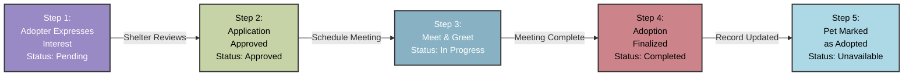

## Track adoption `status`

Observe pet availability and adoption progress in real time.
Learn how to query individual pet profiles and understand
adoption `status` transitions throughout the adoption workflow.

### Adoption `status` workflow

The PawFinder Service API provides an endpoint for retrieving
individual pet profiles and tracking adoption `status` changes.
Complete all appropriate steps in the
[Installation Guide](../../overview/installation-guide.md)
before continuing this tutorial.

PawFinder uses `json-server` with basic `status` tracking.
The diagram below shows what a production adoption platform
might track through the full adoption lifecycle:



### Endpoint structure

```bash
# Recommended base_url = http://localhost:3000
GET {base_url}/pets/{id}
```

### Path parameters

| Parameter | Type | Description | Example |
|-----------|------|-------------|---------|
| `id` | integer | Pet's unique identifier | 1, 2, 3, 4 |

### Understanding adoption `status`

Pets transition through defined `status` states as they move
through the adoption process:

| Status | Meaning |
|--------|---------|
| `available` | Ready for adoption inquiries |
| `pending` | Adoption form under review |
| `adopted` | Successfully placed with a family |

### Start the service

```bash
# Run from the pawfinder-service root directory
npm start
```

Review [Find the Perfect Pet](find-perfect-pet.md)
for an alternative startup method.

### Call the service

Use cURL commands or the Postman desktop app to make requests.
For detailed Postman setup steps, visit the
[Installation Guide](../../overview/installation-guide.md).

#### Use cURL

```bash
# Retrieve the pet profile with `id`= 1
# -X GET is optional, as GET is the default operation
curl -X GET "{base_url}/pets/1" \
  -H "Content-Type: application/json"
```

#### Use Postman desktop app

Set up a `GET` request to `{base_url}/pets/1`

**Response** `200 OK` - Luna's `status` is `available`,
meaning she is ready for adoption inquiries.

```json
{
  "name": "Luna",
  "species": "cat",
  "breed": "Domestic Shorthair",
  "age_months": 18,
  "gender": "female",
  "size": "small",
  "temperament": "playful, affectionate",
  "medical": {
    "spayed_neutered": true,
    "vaccinations": ["fvrcp", "rabies"]
  },
  "description": "Luna is a playful tabby who loves interactive toys and sunny windows.",
  "shelter_id": 1,
  "status": "available",
  "intake_date": "2025-09-01",
  "id": 1
}
```

---

```bash
# Retrieve the pet profile with `id`= 4
# -X GET is optional, as GET is the default operation
curl -X GET "{base_url}/pets/4" \
  -H "Content-Type: application/json"
```

**Response** `200 OK` - `"status": "pending"` means someone's
adoption form is under review. Check back later for updates.

```json
{
  "name": "Bella",
  "species": "dog",
  "breed": "Labrador Retriever",
  "age_months": 12,
  "gender": "female",
  "size": "large",
  "temperament": "friendly, energetic",
  "medical": {
    "spayed_neutered": false,
    "vaccinations": ["rabies", "dhpp"]
  },
  "description": "Bella is a young lab who loves to play fetch and swim.",
  "shelter_id": 4,
  "status": "pending",
  "intake_date": "2025-10-01",
  "id": 4
}
```

---

```bash
# Retrieve the pet profile with `id`= 3
# -X GET is optional, as GET is the default operation
curl -X GET "{base_url}/pets/3" \
  -H "Content-Type: application/json"
```

**Response** `200 OK` - Individual pet profiles include essential medical
information, making a pet's health condition accessible before committing
to adoption.

```json
{
  "name": "Whiskers",
  "species": "cat",
  "breed": "Siamese",
  "age_months": 60,
  "gender": "male",
  "size": "medium",
  "temperament": "vocal, intelligent",
  "medical": {
    "spayed_neutered": true,
    "vaccinations": ["fvrcp", "rabies", "felv"]
  },
  "description": "Whiskers is a talkative senior Siamese who enjoys gentle attention.",
  "shelter_id": 3,
  "status": "available",
  "intake_date": "2025-06-10",
  "id": 3
}
```

### Common error responses

| Code | Scenario | Response |
|---|---|---|
| `400` | Malformed `id` | `{ "error": "Bad Request", "message": "Invalid pet 'id'. Must be a positive integer." ...}` |
| `404` | Invalid `id` | `{ "error": "Not Found", "message": "Pet with 'id' 999 not found." ...}` |

### Best practices

- **Confirm availability before applying**\
Always retrieve the full pet profile before submitting an adoption form.
Confirm the pet is `available` and contact the shelter directly for
detailed status updates.
- **Review medical history**\
Use the `medical` field to understand vaccinations and spay/neuter
condition. Contact the shelter about any concerns before finalizing
adoption.
- **Understand a pet's needs**\
Check the `intake_date` field for how long the pet has been in the
shelter and `description` field for context about their behavior.
- **Poll for `status` updates**\
If developing with this demo API, poll this endpoint manually
and periodically to track `status` changes and test app workflows.
Production implementations might integrate
[webhooks](https://www.geeksforgeeks.org/blogs/what-is-a-webhook-and-how-to-use-it/)
for updates instead.

### Troubleshooting

- **`404 Not Found` response**\
The pet profile `id` doesn't exist. Double-check the `id` matches
a pet profile from the [search results](find-perfect-pet.md).
- **Unexpected `status` change**\
If the perfect pet's profile `status` suddenly shows `adopted`,
the shelter approved another applicant. Search for
[similar pets](find-perfect-pet.md) with similar criteria.
- **Missing medical information**\
All pet profiles should have medical data. If a pet profile seems
incomplete, contact the shelter directly for details.

### Next steps

- Return to [Find the Perfect Pet](find-perfect-pet.md) to search for
pets matching specific criteria.
- For shelter staff: [Mark a Pet as Adopted](mark-pet-adopted.md)
when finalizing adoption.
- Explore
[Build a Location-Aware Search](../../tutorials/building-applications/build-location-aware-search.md)
for a development use case that enables nearby shelter discovery.
- Visit the [Contribution Guide](../../overview/contribution-guide.md)
to report issues or suggest improvements.
