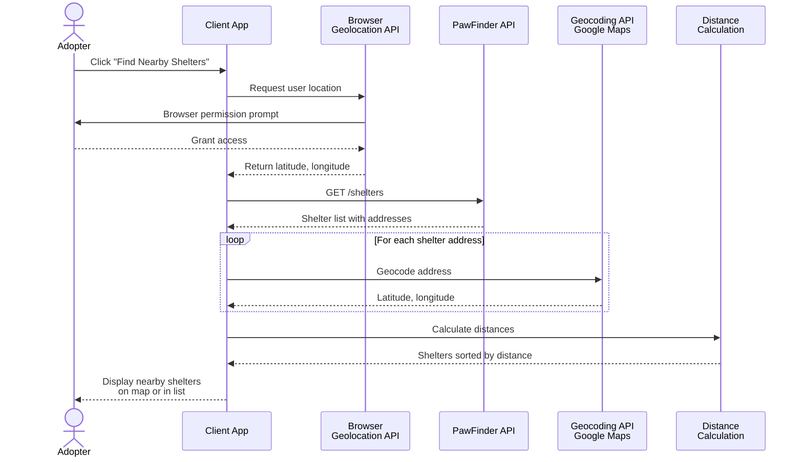

## Build a location-aware search

_This tutorial guides developers building applications that integrate
with PawFinder. Developers write or change JavaScript code in their
own applications. This integration doesn't require enabling a feature
in the PawFinder service itself._

Use client-side location-based filtering to help potential adopters
discover shelters near their current location. Learn how to integrate
geolocation data with the PawFinder Service API and calculate
distances to filter results dynamically.

### Overview

The PawFinder Service is a REST API that provides shelter data with
address information, but location-aware filtering happens on the client
side. This tutorial demonstrates how to retrieve shelter data from the API,
access the adopter's geolocation, calculate distances, and filter shelters
based on proximity.

The separation of concerns is key: the API serves as a data source,
while client-side logic handles geolocation, geocoding, and distance
calculations. This approach keeps the API stateless and allows adopters
to perform location-based searches without more server processing.

### How client-side location-aware search works

PawFinder uses `json-server` to provide shelter data. The diagram below
shows what a production location-aware search implementation might look
like, orchestrating calls between a client app, the PawFinder API, the
browser Geolocation API, and an external geocoding service:



### Prerequisites

Complete all appropriate steps in the
[Installation Guide](../../overview/installation-guide.md)
before continuing this tutorial. This content also
assumes familiarity with the following concepts:

- Retrieving data from REST endpoints using `GET` requests
    - [Quickstart Guide](../../overview/quickstart-guide.md)
- Parsing JSON responses
    - [Working with JSON](https://developer.mozilla.org/en-US/docs/Learn_web_development/Core/Scripting/JSON)
- JavaScript `async/await` patterns
    - [`async` function](https://developer.mozilla.org/en-US/docs/Web/JavaScript/Reference/Statements/async_function)
    - [How to use Promises](https://developer.mozilla.org/en-US/docs/Learn_web_development/Extensions/Async_JS/Promises)
- HTML forms and event handling
    - [Introduction to Events](https://developer.mozilla.org/en-US/docs/Learn_web_development/Core/Scripting/Events)
    - [HTMLFormElement: `submit` event](https://developer.mozilla.org/en-US/docs/Web/API/HTMLFormElement/submit_event)

Web applications leverage standard web platform APIs such as
the [Geolocation API](https://developer.mozilla.org/en-US/docs/Web/API/Geolocation_API)
and [Fetch API](https://developer.mozilla.org/en-US/docs/Web/API/Fetch_API)
to access location data and retrieve shelter information.

Mobile applications integrate native geolocation libraries,
such as [Core Location on iOS](https://developer.apple.com/documentation/corelocation)
or [Google Play Services on Android](https://www.androidauthority.com/google-play-services-1094356/)
to provide location data.

### Architecture: API and client-side logic

Location-aware search follows this workflow:

1. **Retrieve shelter data** from the API using `GET /shelters`
2. **Request user permission** for geolocation using the browser Geolocation API
3. **Parse address data** from shelter objects returned by the API
4. **Geocode addresses**, convert addresses to coordinates, using a mapping service
5. **Calculate distances** between the user's location and each shelter
6. **Filter and sort** shelters by distance
7. **Display results** on a map or in a list

### Step 1: Retrieve shelter data from PawFinder

#### Start the service

```bash
# Run from the pawfinder-service root directory
npm start
```

Review [Find the Perfect Pet](../api-fundamentals/find-perfect-pet.md)
for an alternative startup method.

#### Call the service

Use cURL commands or the Postman desktop app to make requests.
For detailed Postman setup steps, visit the
[Installation Guide](../../overview/installation-guide.md).

**Use cURL**

```bash
# Retrieve all shelter profiles
# -X GET is optional, as GET is the default operation
# Recommended base_url = http://localhost:3000
curl -X GET "{base_url}/shelters" \
  -H "Content-Type: application/json"
```

**Use Postman desktop app**

Set up a `GET` request to `{base_url}/shelters`

**Response** `200 OK` - returns an array of shelter profile
objects with location data:

```json
[
  {
    "name": "Dallas Animal Services",
    "address": "1818 N Westmoreland Rd, Dallas, TX 75212",
    "phone": "+1-214-671-0249",
    "email": "info@dallasanimalservices.org",
    "hours": "Mon-Sat 11:00-18:00",
    "available_pet_count": 22,
    "adoption_fee_range": "75-200",
    "id": 1,
  },
  ...
]
```

### Step 2: Request geolocation permission

The browser Geolocation API allows adopters to share their location.
Request geolocation asynchronously and handle permission responses:

```javascript
function getUserLocation() {
  return new Promise((resolve, reject) => {
    if (!navigator.geolocation) {
      reject(new Error("Geolocation not supported by this browser"));
    }
    navigator.geolocation.getCurrentPosition(
      (position) => {
        const { latitude, longitude } = position.coords;
        resolve({ latitude, longitude });
      },
      (error) => {
        reject(new Error(`Geolocation error: ${error.message}`));
      }
    );
  });
}
```

Users should expect a browser permission prompt. If they deny access,
the promise rejects and an error message displays. If they grant access,
the coordinates resolve with latitude and longitude values.

### Step 3: Geocode shelter addresses

Converting addresses to coordinates requires a geocoding service.
[Google Maps Platform](https://mapsplatform.google.com/) and
[Mapbox](https://www.mapbox.com/) both offer geocoding APIs.
This example uses the Google Maps Geocoding API:

```javascript
async function geocodeAddress(address, apiKey) {
  const encodedAddress = encodeURIComponent(address);
  const url = `https://maps.googleapis.com/maps/api/geocode/json?address=${encodedAddress}&key=${apiKey}`;

  const response = await fetch(url);
  const data = await response.json();

  if (data.results.length === 0) {
    throw new Error(`Couldn't geocode address: ${address}.`);
  }

  const { lat, lng } = data.results[0].geometry.location;
  return { latitude: lat, longitude: lng };
}
```

Geocode all shelter addresses and attach coordinates to shelter objects:

```javascript
async function enrichSheltersWithCoordinates(shelters, apiKey) {
  const enrichedShelters = await Promise.all(
    shelters.map(async (shelter) => {
      try {
        const coords = await geocodeAddress(shelter.address, apiKey);
        return {
          ...shelter,
          latitude: coords.latitude,
          longitude: coords.longitude
        };
      } catch (error) {
        console.error(`Failed to geocode ${shelter.name}:`, error);
        // Return shelter without coordinates if geocoding fails
        return shelter;
      }
    })
  );
  return enrichedShelters;
}
```

### Step 4: Calculate distances

[The Haversine formula](https://en.wikipedia.org/wiki/Haversine_formula)
calculates great-circle distances between two points on a sphere given
their latitudes and longitudes. This implementation returns distance in miles:

```javascript
function calculateDistance(lat1, lon1, lat2, lon2) {
  const earthRadiusMiles = 3959;
  const dLat = (lat2 - lat1) * (Math.PI / 180);
  const dLon = (lon2 - lon1) * (Math.PI / 180);

  const a =
    Math.sin(dLat / 2) * Math.sin(dLat / 2) +
    Math.cos(lat1 * (Math.PI / 180)) *
      Math.cos(lat2 * (Math.PI / 180)) *
      Math.sin(dLon / 2) *
      Math.sin(dLon / 2);

  const c = 2 * Math.atan2(Math.sqrt(a), Math.sqrt(1 - a));
  return earthRadiusMiles * c;
}
```

Add distance calculations to each shelter object:

```javascript
function addDistancesToShelters(shelters, userLat, userLon) {
  return shelters
    .map((shelter) => ({
      ...shelter,
      distance: calculateDistance(userLat, userLon, shelter.latitude, shelter.longitude)
    }))
    .sort((a, b) => a.distance - b.distance);
}
```

### Step 5: Filter shelters by distance radius

Filter shelter locations within a specified distance threshold.
Allow potential adopters to choose their preferred search radius:

```javascript
function filterSheltersByDistance(shelters, maxDistanceMiles) {
  return shelters.filter((shelter) => shelter.distance <= maxDistanceMiles);
}
```

### Putting it together: complete workflow

Combine the steps into a single function that orchestrates the entire flow:

```javascript
async function searchNearestShelters(maxDistanceMiles = 10, mapsApiKey) {
  try {
    // Step 1: Get user location
    const userLocation = await getUserLocation();
    console.log("User location:", userLocation);

    // Step 2: Fetch shelters from API
    const shelterResponse = await fetch("{base_url}/shelters");
    const shelters = await shelterResponse.json();

    // Step 3: Geocode shelter addresses
    const enrichedShelters = await enrichSheltersWithCoordinates(
      shelters,
      mapsApiKey
    );

    // Step 4: Calculate distances
    const sheltersWithDistance = addDistancesToShelters(
      enrichedShelters,
      userLocation.latitude,
      userLocation.longitude
    );

    // Step 5: Filter by radius
    const nearbyShelters = filterSheltersByDistance(
      sheltersWithDistance,
      maxDistanceMiles
    );

    return nearbyShelters;
  } catch (error) {
    console.error("Error searching for nearby shelters:", error);
    throw error;
  }
}
```

### Display results in HTML example

Display filtered shelter profiles in a list with distance information:

```javascript
async function displayNearbyShelters(maxDistanceMiles = 10, mapsApiKey) {
  const shelterList = document.getElementById("shelter-list");
  shelterList.innerHTML = "<p>Finding nearby shelters...</p>";

  try {
    const nearbyShelters = await searchNearestShelters(maxDistanceMiles, mapsApiKey);

    if (nearbyShelters.length === 0) {
      shelterList.innerHTML = "<p>No shelters found within your search radius.</p>";
      return;
    }

    const html = nearbyShelters
      .map(
        (shelter) => `
      <div class="shelter-card">
        <h3>${shelter.name}</h3>
        <p><strong>Address:</strong> ${shelter.address}</p>
        <p><strong>Distance:</strong> ${shelter.distance.toFixed(1)} miles</p>
        <p><strong>Phone:</strong> ${shelter.phone}</p>
        <p><strong>Hours:</strong> ${shelter.hours}</p>
        <a href="${shelter.website}" target="_blank">Visit Website</a>
      </div>
    `
      )
      .join("");

    shelterList.innerHTML = html;
  } catch (error) {
    shelterList.innerHTML = `<p class="error">Error: ${error.message}</p>`;
  }
}
```

HTML structure:

```html
<div class="search-container">
  <label for="distance-input">Search radius (miles):</label>
  <input type="number" id="distance-input" value="10" min="1" max="50"/>
  <button id="search-button">Find Nearby Shelters</button>
</div>

<div id="shelter-list"></div>
```

JavaScript event handler:

```javascript
document.getElementById("search-button").addEventListener("click", () => {
  const maxDistance = document.getElementById("distance-input").value;
  const mapsApiKey = "GOOGLE_MAPS_API_KEY";
  displayNearbyShelters(maxDistance, mapsApiKey);
});
```

### Troubleshooting

- **"Geolocation isn't supported"**\
Some browsers or environments don't support the Geolocation API.
Check `navigator.geolocation` before attempting to access location data.
For development, use mock coordinates to test the filtering logic.
- **"Couldn't geocode address"**\
The Geocoding API may fail if address formatting is inconsistent.
Verify and clean address data from the API response before geocoding.
If a shelter address fails to geocode, log the error and exclude it
from distance calculations.
- **CORS errors when calling Geocoding API**\
[Cross-Origin Resource Sharing errors](https://developer.mozilla.org/en-US/docs/Web/HTTP/Guides/CORS/Errors)
occur when the browser blocks requests to external APIs.
Ensure that the API key has the correct origins configured,
and that requests originate from allowed domains.
- **Slow performance with many shelter locations**\
Geocoding many addresses sequentially is slow.
Use `Promise.all()` to geocode addresses in parallel.
Consider caching geocoded coordinates to avoid
re-geocoding the same addresses on future searches.

### Best practices

- **Cache geocoded coordinates**\
Store geocoded coordinates in local storage or a database to avoid
repeated API calls for the same shelter addresses. Invalidate cache
periodically to account for address changes.
- **Handle geolocation permission denial**\
Not all potential adopters grant location access.
[Provide a fallback](https://developer.mozilla.org/en-US/docs/Web/API/Geolocation_API)
that allows manual address entry or displays all shelter profiles
without distance filtering.
- **Verify API responses**\
Check that geocoding and shelter API responses contain expected fields.
Handle missing or malformed data gracefully.
- **Respect API rate limits**\
Geocoding APIs have rate limits. Use
[request throttling and caching](https://www.geeksforgeeks.org/system-design/api-throttling-vs-api-rate-limiting-system-design/)
to stay within limits, especially for production applications.
- **Test with mock data**\
Use mock coordinates and shelter objects during development to test
filtering and distance calculation logic without relying on live APIs.
- **Provide distance options**\
Allow potential adopters to adjust the search radius dynamically.
Offer preset options such as 5 miles, 10 miles, and 25 miles
for quick filtering.
- **Display loading states**\
[Show feedback](https://primer.style/product/ui-patterns/loading/)
while fetching shelter data, geocoding addresses, and calculating distances.
Long-running operations should communicate progress to the adopter.

### Next steps

- For advanced mapping features, integrate a mapping library like
[Google Maps JavaScript API](https://developers.google.com/maps/documentation/javascript/overview)
or [Mapbox GL JS](https://docs.mapbox.com/mapbox-gl-js/guides/)
to display shelters on an interactive map.
- Check out [Mark a Pet as Adopted](../api-fundamentals/mark-pet-adopted.md)
to understand adoption workflow management from the shelter perspective.
- Explore [Track Adoption `status`](../api-fundamentals/track-adoption-status.md)
to observe pet availability changes in real time.
- Visit the [Contribution Guide](../../overview/contribution-guide.md)
to report issues or suggest improvements.
