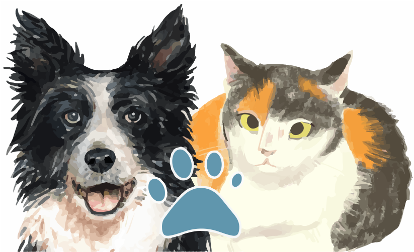

## PawFinder API Documentation

Connect paws to people with the PawFinder REST API. Integrate
adoptable pet data into apps, websites, and services to help
families find their perfect match.

### Start here

- [Overview](./docs/overview/overview.md)\
Learn key concepts. Discover how different development audiences use the API.
- [Installation Guide](./docs/overview/installation-guide.md)\
Set up the development environment before moving on to the tutorials.
- [Authentication Guide](./docs/overview/authentication-guide.md)\
Create API tokens for write operations.
- [Quickstart Guide](./docs/overview/quickstart-guide.md)\
Make a `GET` request to `/pets` and view annotated JSON examples.
- [Contribution Guide](./docs/overview/contribution-guide.md)\
Report issues and suggest improvements.

### API reference

- [API Index](./docs/api-reference/api-index.md)\
Reference all endpoint operations, parameters, and responses.
- `/pets` endpoint
    - [GET /pets?{query_parameters}](./docs/api-reference/get-pets-with-filters.md)\
    Search and filter pet profiles.
    - [GET /pets/{id}](./docs/api-reference/get-pets-by-id.md)\
    Retrieve detailed information for a specific pet.
- `/shelters` endpoint
    - [GET /shelters](./docs/api-reference/get-all-shelters.md)\
    Retrieve the profiles of all participating shelters.
    - [GET /shelters/{id}](./docs/api-reference/get-shelters-by-id.md)\
    Get detailed shelter information and contact details.

### Tutorials

- API Fundamentals
    - [Find the Perfect Pet](/docs/tutorials/api-fundamentals/find-perfect-pet.md)\
    Filter pet profiles by species, breed, shelter, and other criteria.
    - [Mark Pets as Adopted](/docs/tutorials/api-fundamentals/mark-pet-adopted.md)\
    Update a pet profile when finalizing adoptions.
    - [Track Adoption Status](/docs/tutorials/api-fundamentals/track-adoption-status.md)\
    Follow pet availability and adoption status in real-time.
- Building Applications
    - [Build a Location-Aware Search](/docs/tutorials/building-applications/build-location-aware-search.md)\
    Apply proximity filtering and distance calculations.

### Get help

- Check real-time API status at [status.pawfinder.com](status.pawfinder.com)
- Found an error or have a suggestion?
[Report it here](https://github.com/rhyannonjoy/pawfinder-service/issues).
- Need help integrating? [Contact support@pawfinder.com](support@pawfinder.com)
